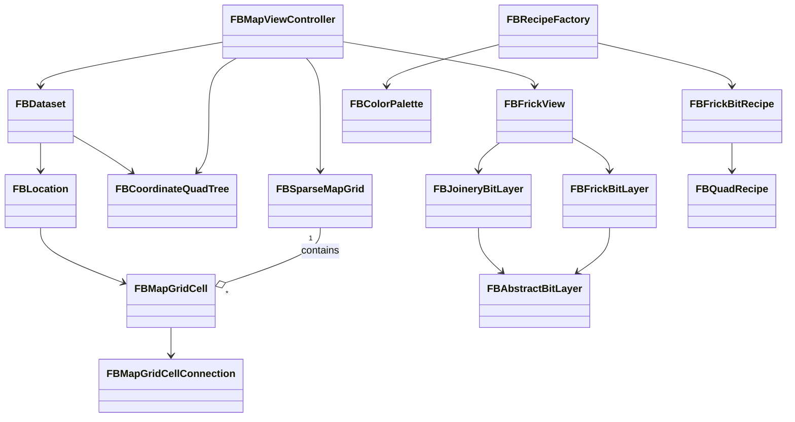

# FRICKbits Architecture

This document describes the high-level architecture of FRICKbits, with diagrams and notes on data flow, major components, and the rendering pipeline.

---

## Data Flow (High-level)

Dataset -> Grid/QuadTree -> Map Controller -> FrickView -> Layers & Animations

- `FBDataset` (CSV/JSON loader) -> `FBLocation`s
- `FBSparseMapGrid` (grid cells and connections) + `FBCoordinateQuadTree` (clustering)
- `FBMapViewController` loads dataset, sets the map region, and calls `FBFrickView` to update (which includes generating annotations & overlays via `FBMapAnnotations`)
- `FBFrickView` creates `joinery` nodes (`FBJoineryBitLayer`) and connection bits (`FBFrickBitLayer` and others), then schedules animations via `NSOperationQueue`.

---

## Class Relationship (diagram)

Mermaid-style diagram (for supported renderers):



### ASCII Architecture Diagram

Front-end:

```
+---------------------------+             +-------------------------+
|  FBMapViewController      |             |       UI / Map          |
|  - loads dataset          |  updates => | MKMapView / overlays    |
|  - sets region, gestures  |             | (MBXMapKit overlays)    |
+-------------+-------------+             +-------------------------+
              |                                               /
              |   uses                                         /
+-------------v-------------+                              /
|    FBSparseMapGrid        |<--- contains ---+            /  
|    - grid cells (64px)    |                 |           /
|    - cell connections     |                 |          /  
+-------------+-------------+                 |         /   
              |                               |        /
+-------------v--------------+   generates    |       /    
|       FBFrickView          |----------------+      /     
|  - create joinery nodes    |  connection bits     /      
|  - schedule animations     | - FBFrickBitLayer   /       
|  - animate flow with BFS   | - FBSegmentedBitLayer       
+---------------------------+                         

```

---

## Rendering Pipeline & Animations
1. `FBFrickView.updateWithMapView:` begins by clearing the previous sublayers.
2. `updateCellJoinNodesWithMapView:` determines which cells should show a joinery bit vs cluster bit (based on `mapGrid.averageLocationCount` and thresholds).
3. `updateConnectionFrickBitsWithMapView:` creates a bit for each connection that is onscreen and not a same-join node.
4. Bits are added as CALayers and `maybeJoinToJoinNode` is called to shorten/anchor bits to joinery nodes.
5. `breadthFirstVisitCell1:` (or other BFS variant) traverses the graph and schedules join node `animateIn` ops and `bit animateFromTo` ops with `NSOperationQueue` so the animation flows across the graph with configurable delays and durations.

---

## Optimization & Known Constraints
- Shortcut detection (`hitShortcutFromCell:toCell:`) can be O(n^2) for large dx/dy; there's a line-length cutoff of 25 rows/cols to limit processing.
- Animation uses operations + sleep to coordinate; there's potential for optimization by switching to CADisplayLink and CoreAnimation implicit timing.

---

## Where to extend or replace
- Replace TBQuadTree with a different spatial index if needed (e.g., R-Tree) for performance.
- Adjust `FBCellSizeForZoomScale()` for different visual resolutions.
- Add simpler, precomputed path normalization to reduce duplicate computation in `maybeJoinToJoinNode`.

---

If you'd like, I can also add a `diagram.svg` or `diagram.png` produced from the mermaid content; let me know which format you prefer.